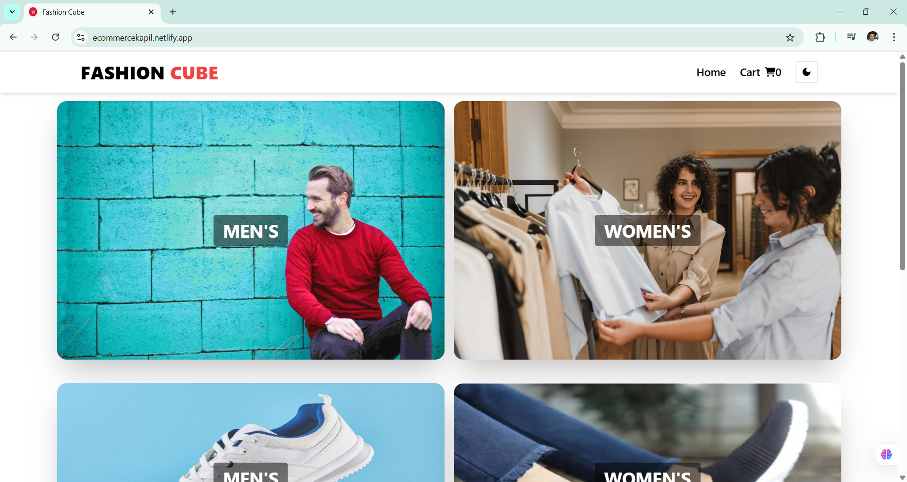
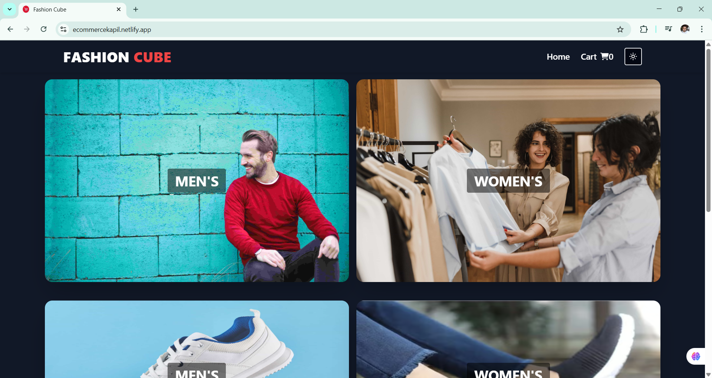
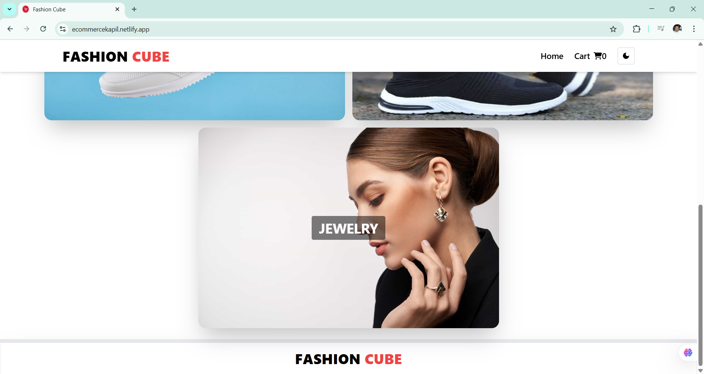
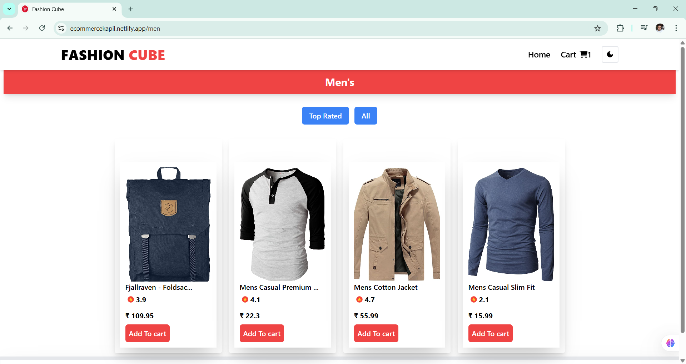
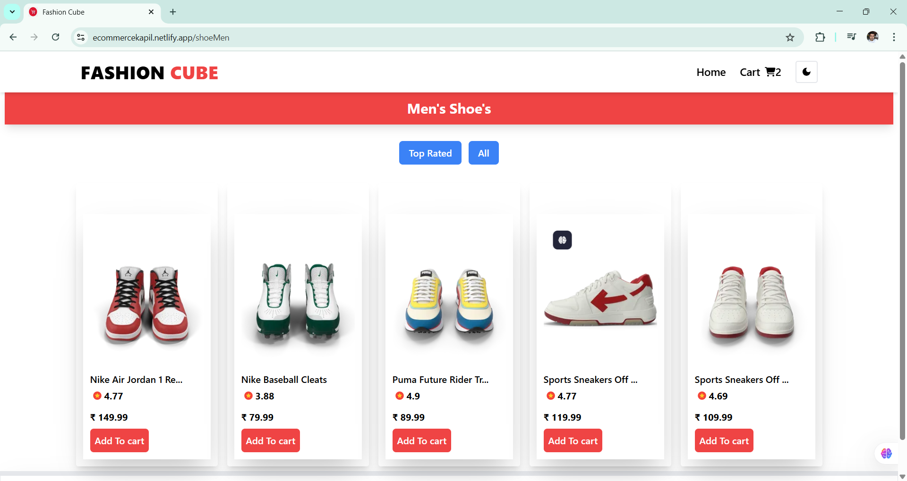
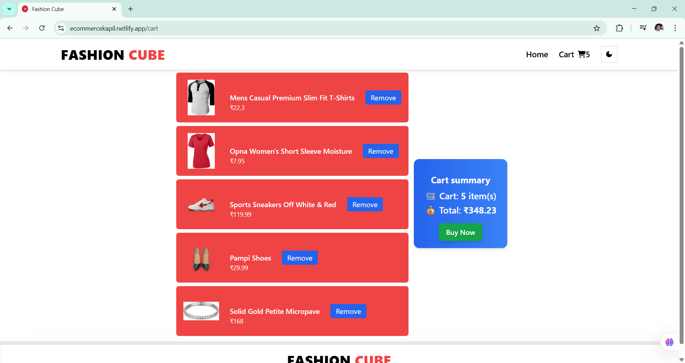
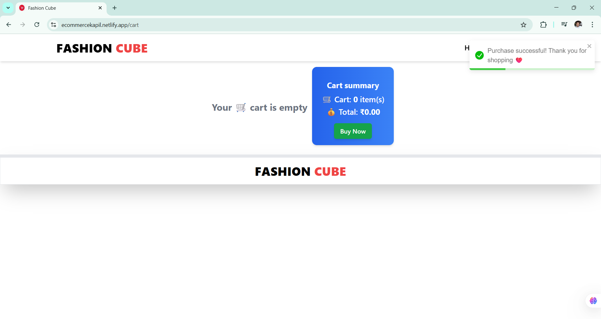

### E-COMMERCE APP

[LIVE LINK](https://ecommercekapil.netlify.app/)

### OVERVIEW :

- A E-Commerce App Created using React-JS,Tailwind-CSS,ReduxToolKit.

- There are specific sections for MEN'S,WOMEN.S(CLOTHING), MEN'S, WOMEN'S(SHOES), JEWELRY.

- User Filter Top Rated Products from each of the above sections.

- Toggle between Dark/Light Mode using Redux Toolkit.

- Add To Cart, Remove From Cart, Buy Now Features are there using ReduxToolKit.

#### Libraries and Technologies Used :

- React: A JavaScript library for building user interfaces.
- React Router DOM: For handling routing and navigation in the application.
- Redux Toolkit: To manage the global state and store.
- Tailwind CSS: For modular and responsive styling.
- React-Toastify Used for giving alerts like product added to cart,, product removed, product purchased.

