# 🎬 Netflix GPT  
> AI-Powered Movie Recommendation Web App (Gemini AI + TMDB)

<p align="center">
  
</p>

<p align="center">
  
  
  
  
  
  
</p>

---

## 📑 Table of Contents
- [Overview](#-netflix-gpt)
- [Features](#-features)
- [Tech Stack](#-tech-stack)
- [Live Demo](#-live-demo)
- [Screenshots](#-screenshots)
- [Getting Started](#-getting-started)
- [Contributing](#-contributing)
- [License](#-license)

---

## 📖 Overview
**Netflix GPT** is a modern web application that integrates **Gemini AI** to deliver **personalized movie and web series recommendations** through natural language queries.  
It also features a **guest mode** for quick demo access, multilingual support, and a clean, Netflix-inspired design.

---

## ✨ Features
- 🔐 **Secure User Authentication** with Firebase/Auth  
- 🌍 **Multi-language Support** for global accessibility  
- 🎬 **Trending Movies & Web Series** showcased on the homepage  
- 👥 **Guest Mode** for demo access without signing in  
- 🤖 **AI-Powered Recommendations** using Gemini AI  
- 📱 **Responsive, Mobile-First Design**  
- ⚡ **Seamless Navigation** with React Router DOM

---

## 🛠️ Tech Stack
- **Frontend:** React.js, Redux Toolkit, React Router DOM, Tailwind CSS  
- **AI Integration:** Gemini AI API  
- **Content Source:** TMDB API  
- **UI & Icons:** React Icons, Tailwind Components  
- **Auth & Security:** Firebase Authentication  
- **Deployment:** Netlify  

---

## 🌐 Live Demo
🔗 [**View Netflix GPT**](https://kapilmoviebaseproject.netlify.app/)

---

## 📸 Screenshots
<p align="center">
  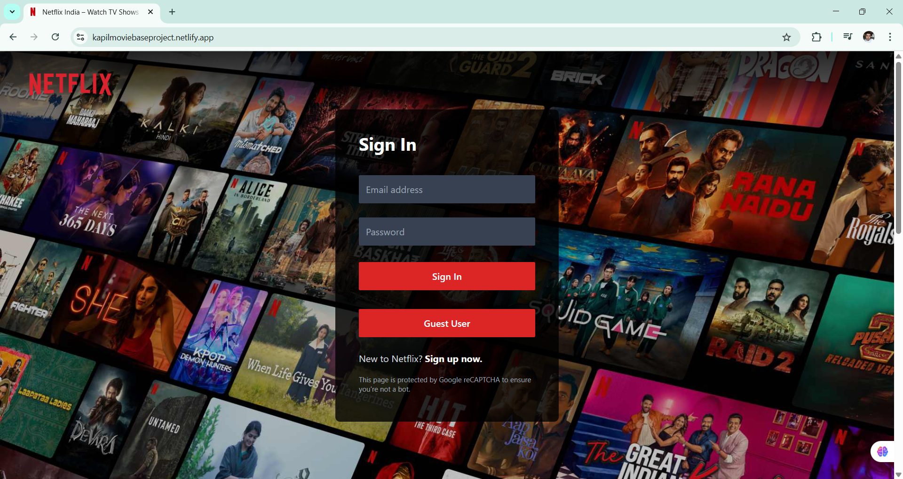 
  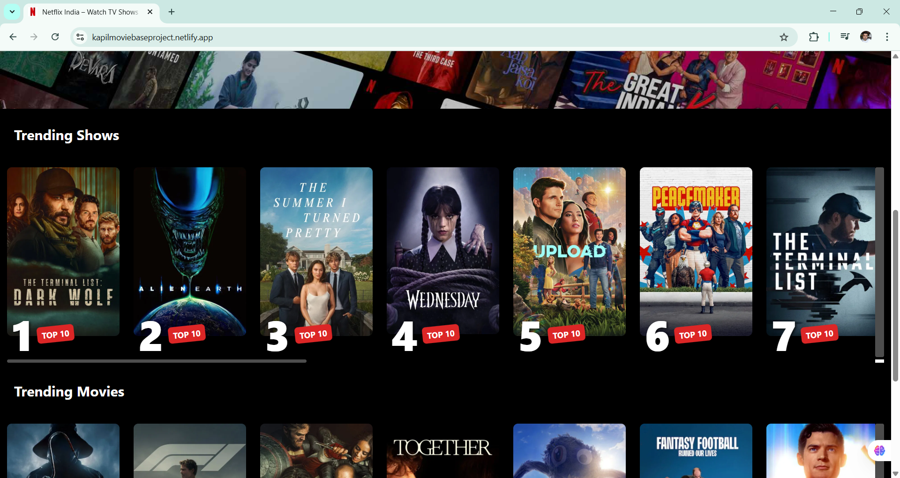 
  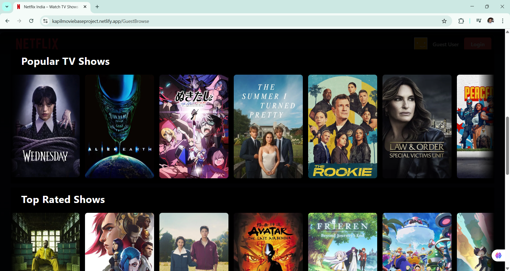
</p>
<p align="center">
  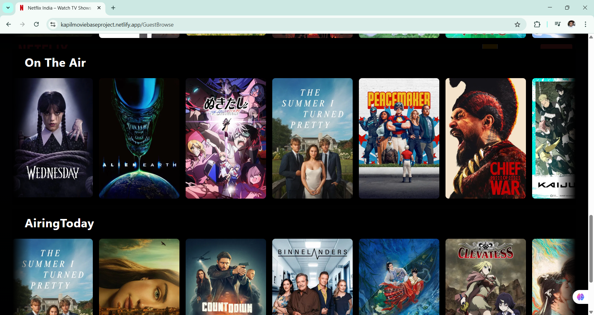 
  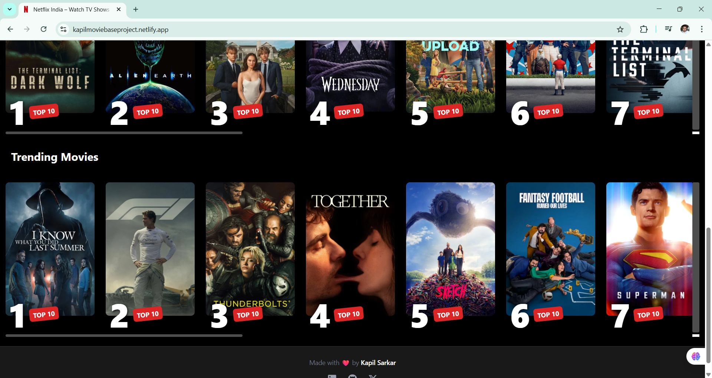 
  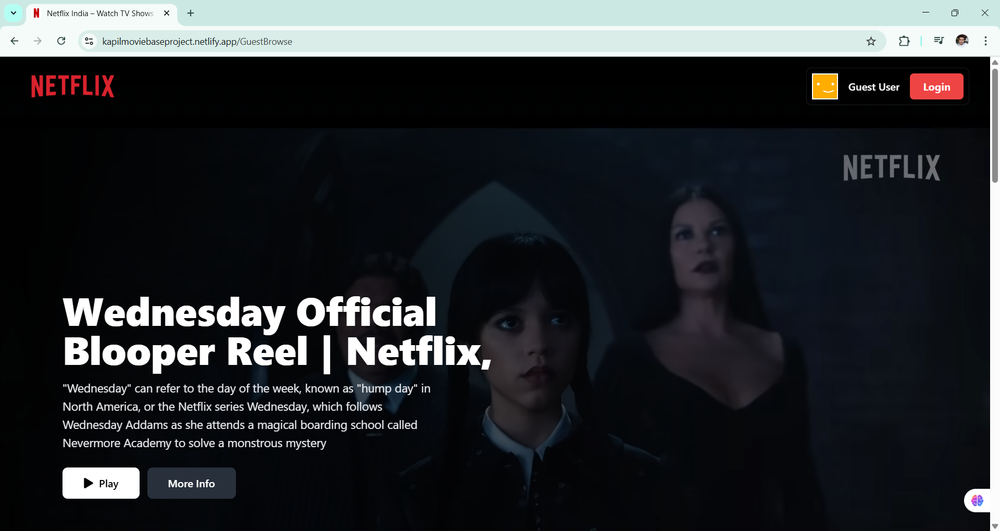
</p>
<p align="center">
  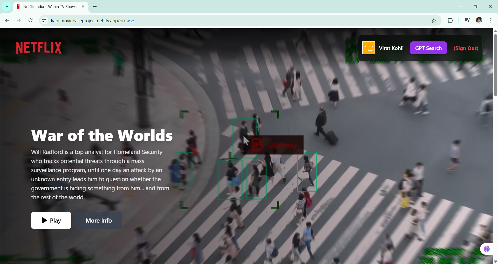 
  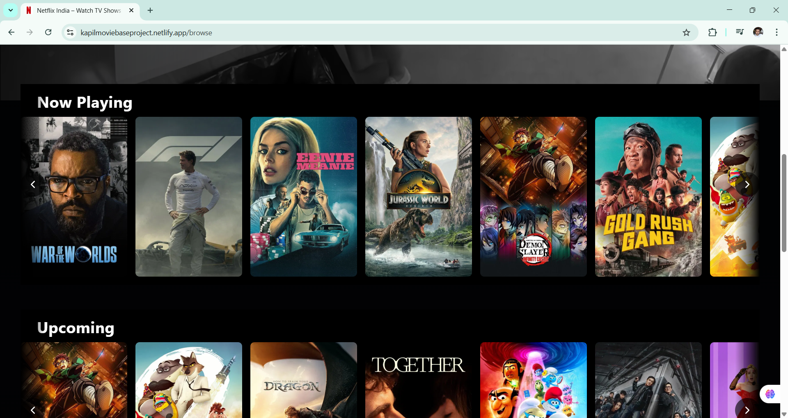 
  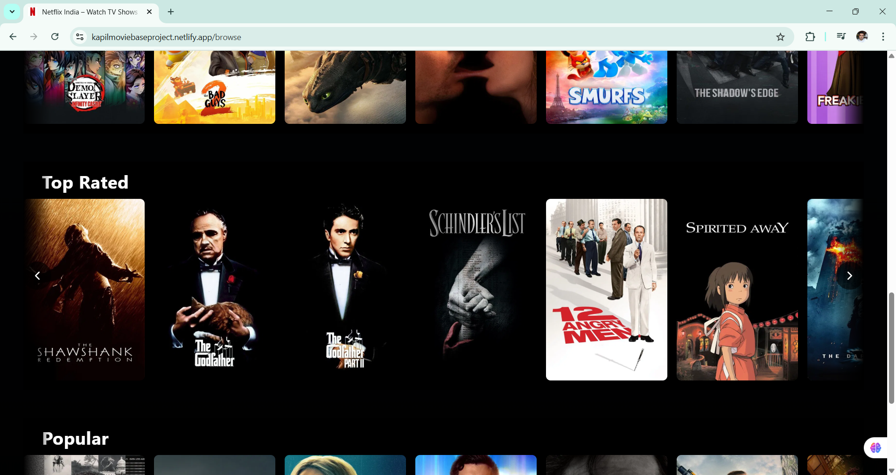
</p>
<p align="center">
  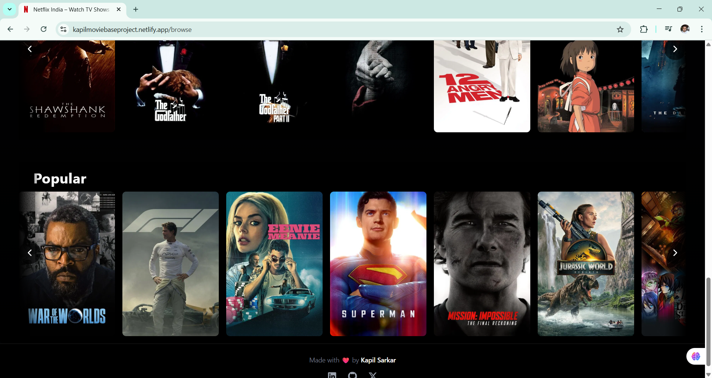 
  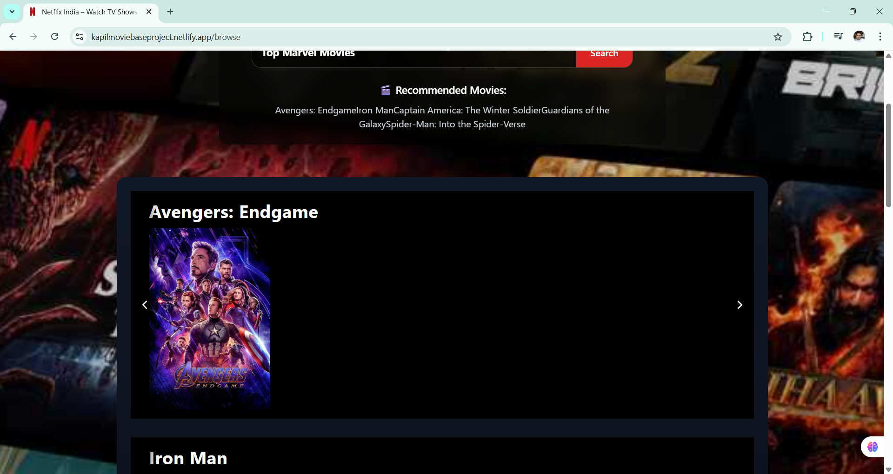 
  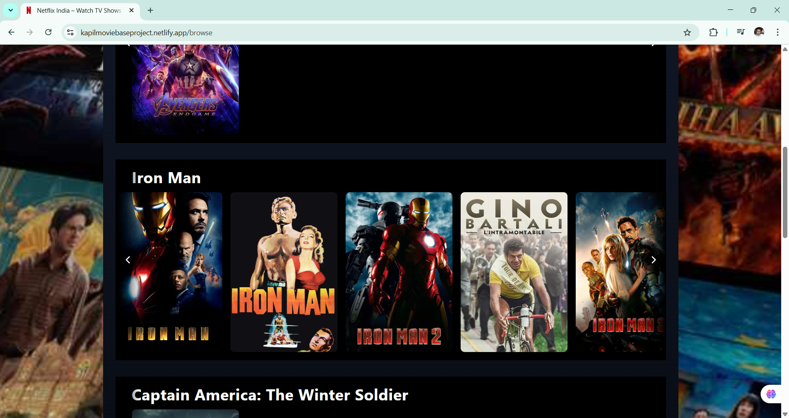
</p>
<p align="center">
  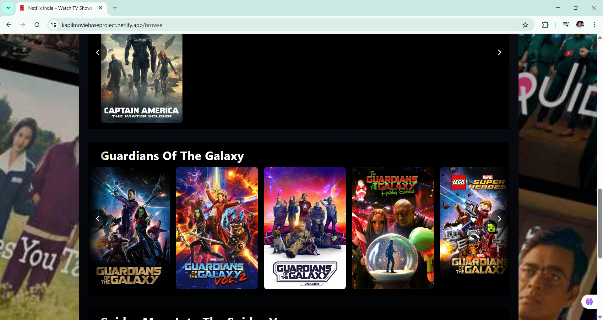 
  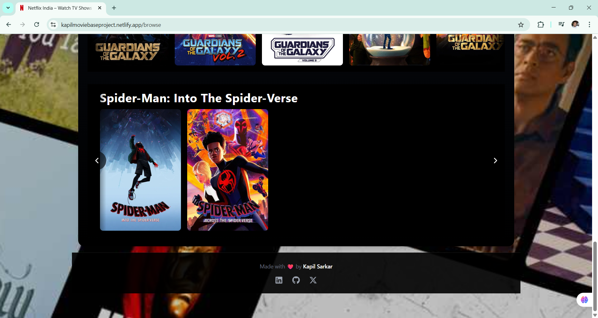 
  
</p>
<p align="center">
  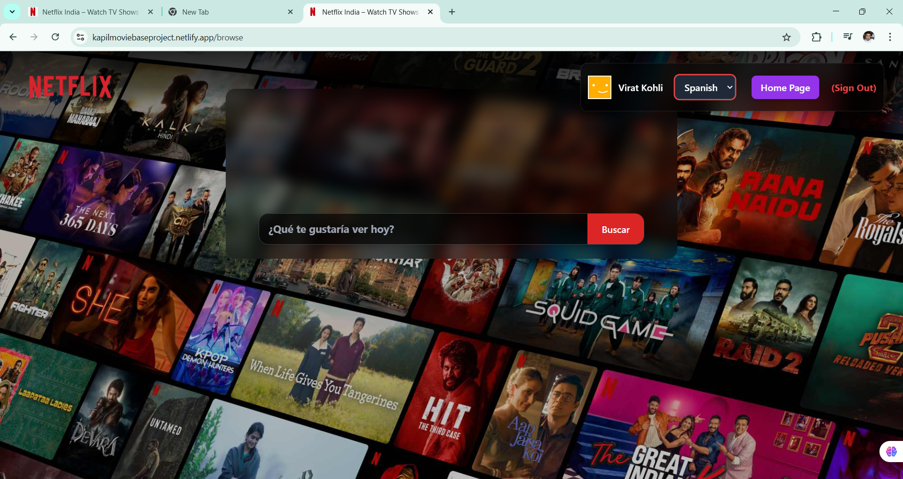 
  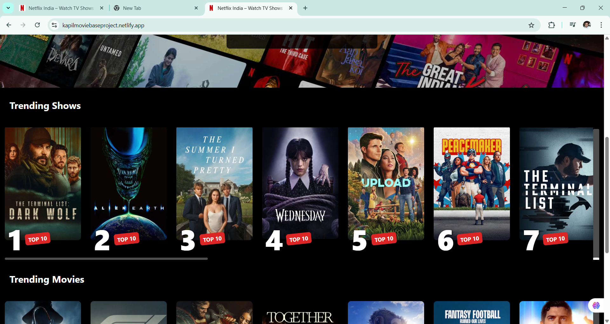
</p>

---

## 🚀 Getting Started

Follow these steps to run Netflix GPT locally:

1. **Clone the repository:**
   ```bash
   git clone https://github.com/yourusername/netflix-gpt.git
   cd netflix-gpt

 2.   Install dependencies:

npm install
