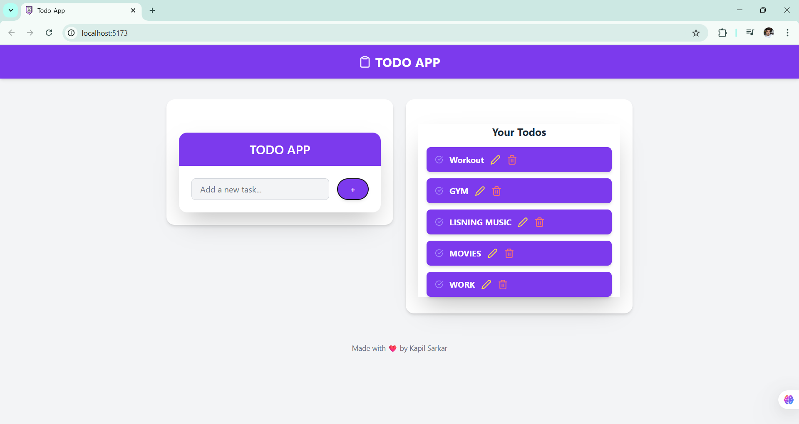
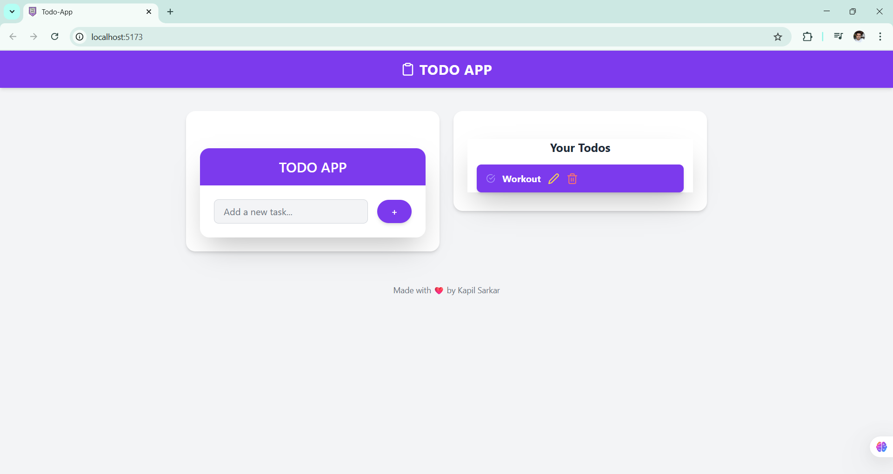
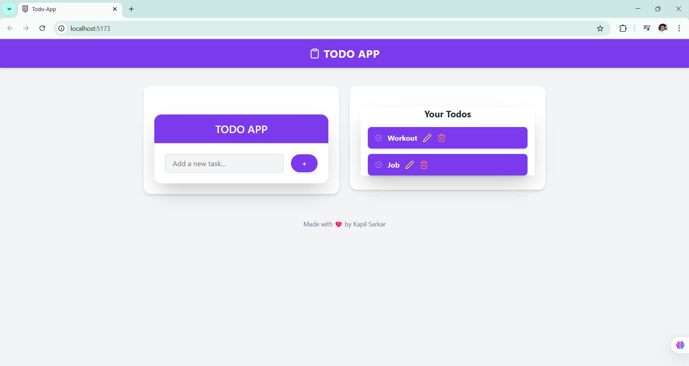
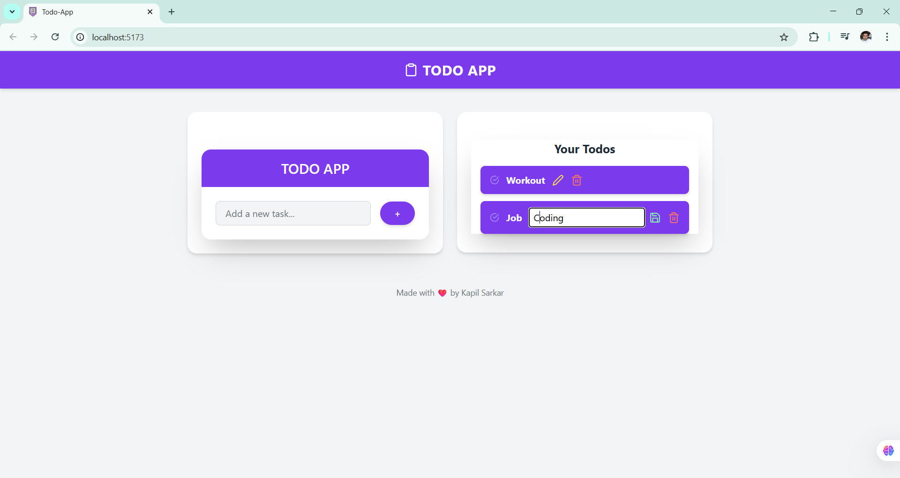

# 📝 TODO App using Redux Toolkit

A simple and elegant TODO application built with **React**, **Redux Toolkit**, and **TailwindCSS**, featuring full **CRUD operations** and smooth **animations** with **Framer Motion**.

---
[LIVE LINK](https://todoappkapilsarkar.netlify.app/)
---
## 🚀 Features

- ✅ **Create** new todos with ease
- 👁️ **Read** and view your current task list
- 🔄 **Update** existing todos with inline editing
- 🗑️ **Delete** tasks with a single click
- 🎨 **Framer Motion** for smooth UI animations
- 🌗 Responsive design with **dark mode** support
- 📦 Powered by **Redux Toolkit** for global state management

---

## 🧩 Tech Stack

- **React.js**
- **Redux Toolkit**
- **Framer Motion**
- **TailwindCSS**
- **React Icons**

---

## 📸 Screenshots

🧠 Concepts Covered :

- Redux slice creation using createSlice

- Connecting components with useSelector and useDispatch

- Using nanoid for unique IDs

- Animating with Framer Motion (motion.div, AnimatePresence)

- Clean UI layout with TailwindCSS.

✅ Future Improvements :

- Add persistence with LocalStorage or Firebase

- Filter completed vs. pending tasks

- Add toast notifications for actions

- Implement drag-and-drop sorting

